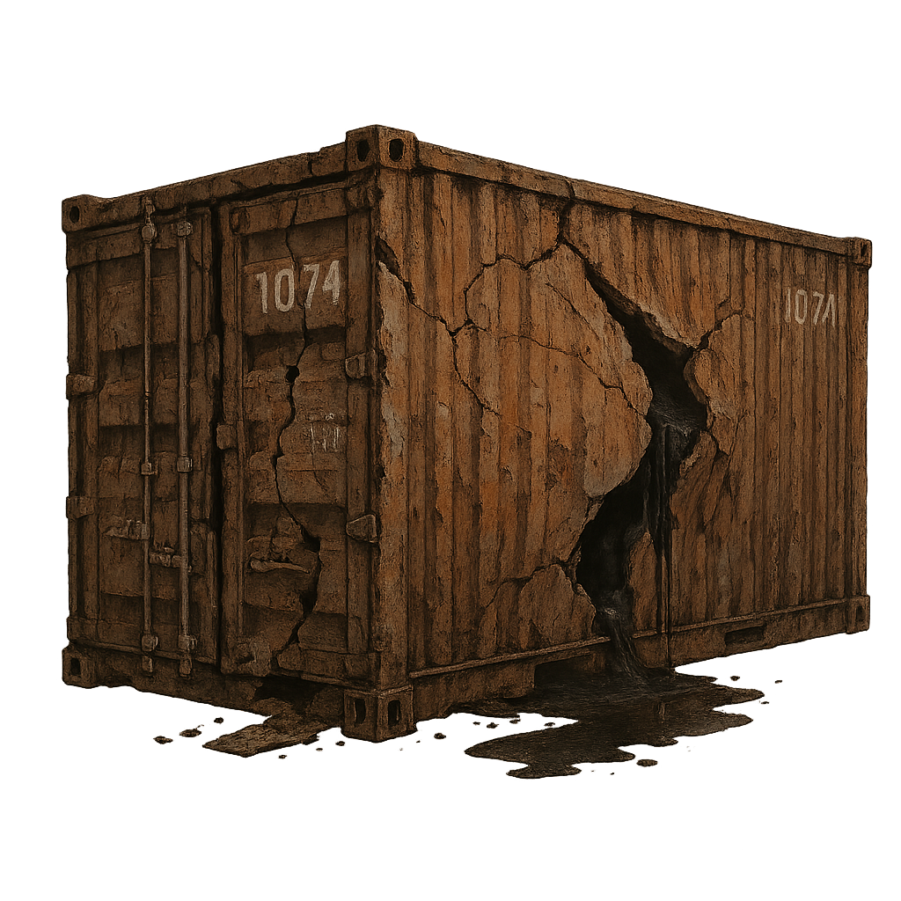

# Contain-ish 📦

A naive and simplistic containerization system written in Go. **Contain-ish** is for educational purposes to demonstrate basic container concepts using Linux namespaces.

---

## 📋 Requirements

- **Go** (1.16 or higher) 🏁
- **Linux** 🐧
- **Root Access** 🔑

---

## 🛠️ Installation

```bash
git clone https://github.com/yourusername/containish.git
cd containish
go build -o containish
